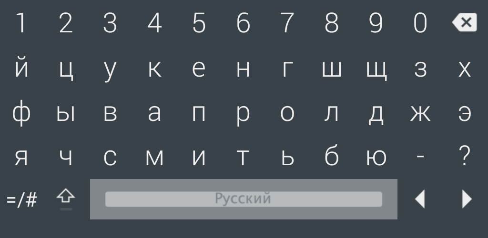
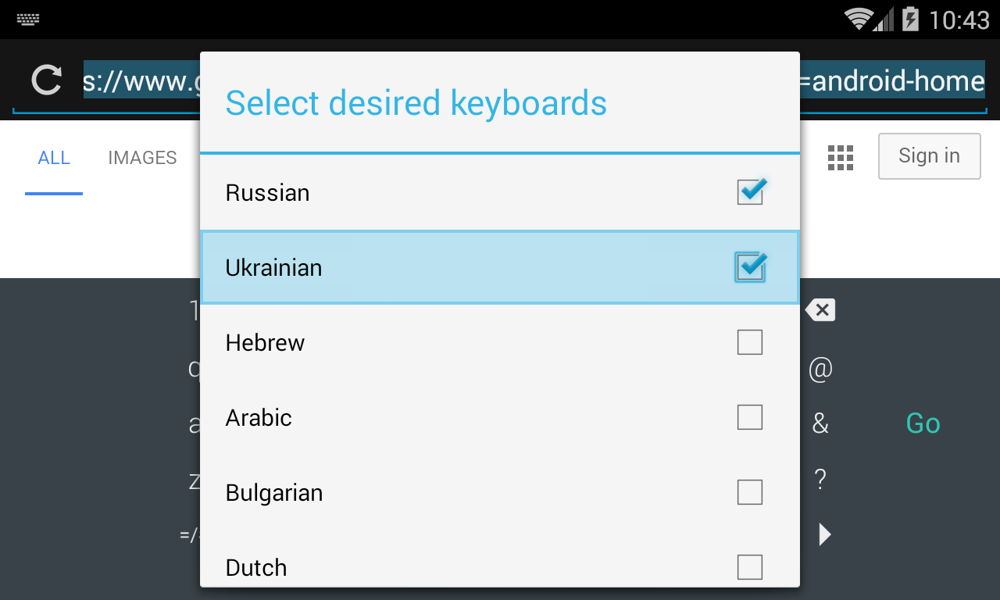

 LeanKeyboard
=========

__LeanKeyboard: Keyboard for Android-based set-top boxes and TVs:__

 * <a href="https://play.google.com/store/apps/details?id=org.liskovsoft.androidtv.rukeyboard" target="_blank">Google Play page</a>
 * <a href="https://t.me/LeanKeyboard">Telegram group</a>

__NOTE: Google Play release is outdated. So I recommend to obtain new releases [here](https://github.com/yuliskov/LeanKeyboard/releases).__

### Features:
 * Designed for TV screens.
 * Any remote controller support.
 * Supports dozens of languages.
 * Doesn't depend on Google Services.
 * __No root required!__

__Tip: Switch to other language with language button or by long press on the space bar__

__Tip: Do long press on the language button to choose between available languages__

### Screenshots:
 * __[Open screenshots](#screens)__

### Install LeanKeyboard:
__Easy installation in less than 10 minutes with only FireTV__
 * <a href="https://github.com/yuliskov/LeanKeyboard/wiki/How-to-Install-LeanKeyKeyboard-on-FireTV">Install LeanKeyKeyboard (only FireTV needed)</a>

__Standard installation via ADB__
 * If you don't know how to sideload/install apps via ADB, read a tutorial (e.g. <a href="http://kodi.wiki/view/HOW-TO:Install_Kodi_on_Fire_TV" target="_blank">this one</a>)
 * <a href="https://github.com/yuliskov/LeanKeyboard/releases" target="_blank">Download latest LeanKeyKeyboard APK</a> and sideload/install with adb: 
 * *adb install -r LeanKeyboard.apk*
 * Enjoy :)

### Donation:
If you want to support my developments you are welcome to buy me a cup of coffee :)
 <!-- * [QIWI (RU, Visa)](https://qiwi.com/n/GUESS025)   -->
 <!-- * [DonatePay (RU, **PayPal**, Visa)](https://new.donatepay.ru/@459197)   -->
 * [**Patreon**](https://www.patreon.com/yuliskov)  
 * **PayPal**: firsthash at gmail.com
 * **BTC**: 1JAT5VVWarVBkpVbNDn8UA8HXNdrukuBSx  
 * **LTC**: ltc1qgc24eq9jl9cq78qnd5jpqhemkajg9vudwyd8pw  
 * **ETH**: 0xe455E21a085ae195a097cd4F456051A9916A5064  
 * **ETC**: 0x209eCd33Fa61fA92167595eB3Aea92EE1905c815  
 * **XMR**: 48QsMjqfkeW54vkgKyRnjodtYxdmLk6HXfTWPSZoaFPEDpoHDwFUciGCe1QC9VAeGrgGw4PKNAksX9RW7myFqYJQDN5cHGT
 * **BNB**: bnb1amjr7fauftxxyhe4f95280vklctj243k9u55fq  
 * **DOGE**: DBnqJwJs2GJBxrCDsi5bXwSmjnz8uGdUpB  
 * **eUSDT**: 0xe455e21a085ae195a097cd4f456051a9916a5064
 
### Reviews / Articles:
 * [__XDA Discussion__](https://forum.xda-developers.com/fire-tv/general/guide-change-screen-keyboard-to-leankey-t3527675)
 
### Changelog:
 * [Check releases page for changelog ..](https://github.com/yuliskov/LeanKeyboard/releases)

### Contributors:
 * __[aglt](https://github.com/aglt)__ (Icelandic lang)
 * __[rabin111](https://github.com/rabin111)__ (Thai lang)

### Developer:
 * __[yuliskov](https://github.com/yuliskov)__ (design & coding)

### Screens:

