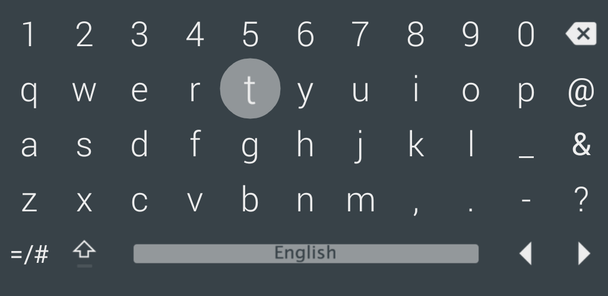

 LeanKeyKeyboard
=========

__LeanKeyKeyboard: An Keyboard for Android-based set-top boxes and TVs:__

Visit Google Play page: 
 * <a href="https://play.google.com/store/apps/details?id=org.liskovsoft.androidtv.rukeyboard" target="_blank">[APP] LeanKeyKeyboard</a>

### Features:

 * Designed for TV screens.
 * Any remote controller support.
 * Support dozens of languages through the language packs.
 * Doesn't depend on Google Services.
 * __No root required!__

__Switch to other language performed with menu key or with long press of the space bar.__

### Install LeanKeyKeyboard:

__Easy installation in less than 5 minutes with only the FireTV__
 * <a href="https://github.com/yuliskov/SmartYouTubeTV/wiki/Install-SmartYouTubeTV-(only-FireTV-needed)">Install LeanKeyKeyboard (only FireTV needed)</a>

__Standard installation via ADB__
 * If you don't know how to sideload/install apps via ADB, read a tutorial (e.g. <a href="http://kodi.wiki/view/HOW-TO:Install_Kodi_on_Fire_TV" target="_blank">this one</a>)
 * <a href="https://github.com/yuliskov/LeanKeyKeyboard/releases" target="_blank">Download latest LeanKeyKeyboard APK</a> and sideload/install with adb: 
 * *adb install -r LeanKeyKeyboard.apk*
 * Enjoy :)
 
### Reviews / Articles:
 * Just google for "LeanKey Keyboard"
 
### Changelog:
 * [Check releases page for changelog ..](https://github.com/yuliskov/LeanKeyKeyboard/releases)

### Screenshots:

### Why using it:
 * LeanKeyKeyboard provides possibility to enter text with any length.
 * LeanKeyKeyboard provides support for the multiple remote controllers which allows you to enter text in a very convenient way.
 
### Donation:
If you want to support my developments you are welcome to buy me a cup of coffee :)
 * coming soon
